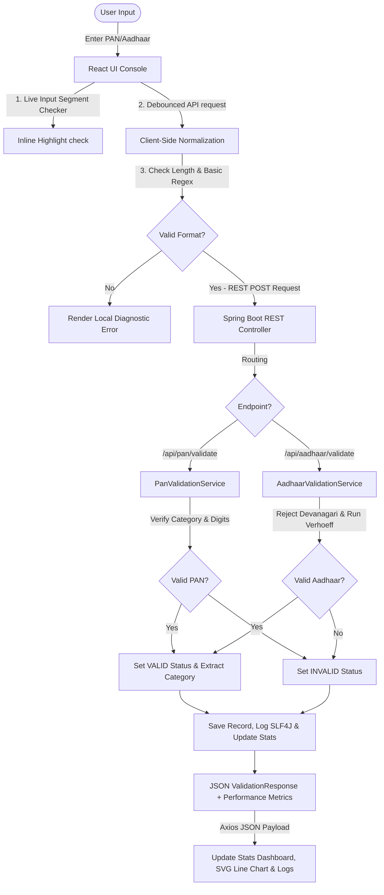

# Technical Documentation: SecureKYC Validator

This document provides a deep dive into the architecture, API endpoints, validation logic algorithms, global exception mapping, scoring calculators, and future expansion paths of the SecureKYC Validator system.

---

## 1. System Architecture Diagram
Below is the system architecture showing the flow of validation requests from the client's browser, through local client-side normalization, to the backend service.



---

## 2. Interactive Swagger / OpenAPI Documentation
The application features **Swagger UI** for interactive exploration and execution of all REST API endpoints.
*   **Swagger Web UI Link:** `http://localhost:8080/swagger-ui/index.html`
*   **OpenAPI Raw JSON Definition:** `http://localhost:8080/v3/api-docs`

Every endpoint (PAN validator, Aadhaar validator, history log loader, metrics summary, and history reset triggers) is fully documented inside the OpenAPI metadata.

---

## 3. FinTech Compliance Scoring Formulas
To assess database-ready input quality, the application computes three score metrics for each validation transaction:

### 1. Confidence Score
Evaluates the reliability of the validation logic:
*   **Aadhaar (99%):** Checked against format structure AND the mathematically rigorous Verhoeff algorithm.
*   **PAN (95%):** Checked against structural letters, category mappings, and digit indices.
*   **Invalid Entries (0%):** Deemed unreliable and rejected immediately.

### 2. Input Quality Score
Assesses input cleanliness, starting at **100%** and deducting points for cleansing adjustments:
*   **Spacing removals:** `-10%` per trimmed/removed space.
*   **Hyphen sanitizations:** `-15%` per removed hyphen.
*   **Casing changes:** `-10%` per converted lowercase character.
*   **Minimum score:** Clamped at a baseline of `10%` for severely misformatted but valid entries.

### 3. Security Score
Evaluates client-network data safety metrics during verification checks:
*   **Aadhaar (96%):** Incorporates checksum, masked text displays (`XXXX-XXXX-9936`), and regex filters.
*   **PAN (92%):** Incorporates segment filters and category masks.
*   **Invalid Entries (50%):** Baseline security checks run but failed compliance.

---

## 4. REST API Documentation & Exception Responses

### 1. Validate PAN
*   **Endpoint:** `POST /api/pan/validate`
*   **Request Body:**
    ```json
    {
      "value": "ABCPD1234Z"
    }
    ```
*   **Response Body (Valid PAN):**
    ```json
    {
      "status": "VALID",
      "reason": "Valid PAN Card",
      "normalizedValue": "ABCPD1234Z",
      "timestamp": "2026-07-04T02:01:30.769",
      "details": {
        "type": "PAN",
        "originalInput": "ABCPD1234Z",
        "normalizedValue": "ABCPD1234Z",
        "categoryCode": "P",
        "categoryName": "Individual",
        "expectedFormat": "AAAAA9999A",
        "validationTimeMs": 0.05,
        "confidenceScore": 95,
        "qualityScore": 100,
        "securityScore": 92
      }
    }
    ```

### 2. Validate Aadhaar
*   **Endpoint:** `POST /api/aadhaar/validate`
*   **Request Body:**
    ```json
    {
      "value": "9999-3399-9936"
    }
    ```
*   **Response Body (Valid Aadhaar):**
    ```json
    {
      "status": "VALID",
      "reason": "Valid Aadhaar Card",
      "normalizedValue": "999933999936",
      "timestamp": "2026-07-04T02:01:30.728",
      "details": {
        "type": "AADHAAR",
        "originalInput": "9999-3399-9936",
        "normalizedValue": "999933999936",
        "maskedValue": "XXXX-XXXX-9936",
        "expectedFormat": "12 Digits (e.g. XXXX XXXX XXXX)",
        "validationTimeMs": 0.08,
        "confidenceScore": 99,
        "qualityScore": 70,
        "securityScore": 96
      }
    }
    ```

### 3. Global Exception Payload Mapping
When a request fails due to empty fields or formatting validation check errors, the `@RestControllerAdvice` formats the response:
*   **Endpoint:** `POST /api/pan/validate` with body `{ "value": "" }`
*   **HTTP Response Status:** `400 Bad Request`
*   **Response Body:**
    ```json
    {
      "timestamp": "2026-07-04T02:02:11.456",
      "status": 400,
      "error": "Validation Error",
      "message": "Value cannot be blank",
      "path": "/api/pan/validate"
    }
    ```

---

## 5. Validation Rules Diagnostics & Troubleshooting
The console renders troubleshooting panels for invalid items:
*   **Detailed Explanations:** Explains the specific index or format error (e.g. "Expected exactly 10 characters. Your input contains 8 character(s)").
*   **Suggestions checklist:** Returns actions to resolve the validation check (e.g. "Replace the fourth character with an uppercase alphabet representing your tax status").

---

## 6. Future Enhancements
*   **Database Integration:** Replace the concurrent in-memory logs repository with a persistent database (PostgreSQL).
*   **Camera OCR Scanner:** Integrate browser camera APIs with Tesseract.js to extract numbers from physical cards.
*   **Government Gateways Sandbox:** Connect to official UIDAI and NSDL staging routes to verify active/inactive statuses.
